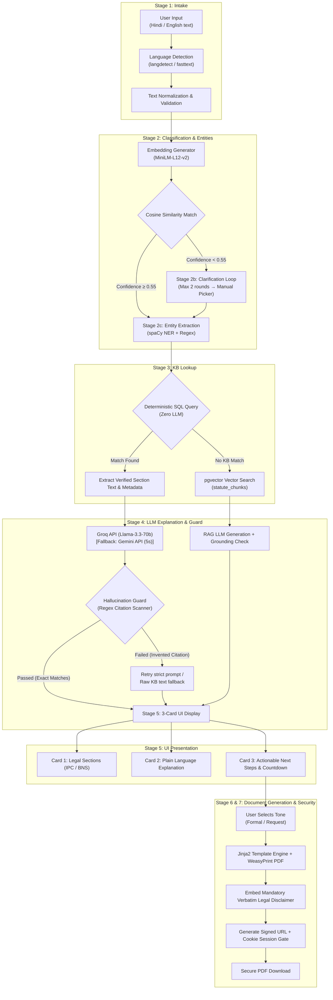
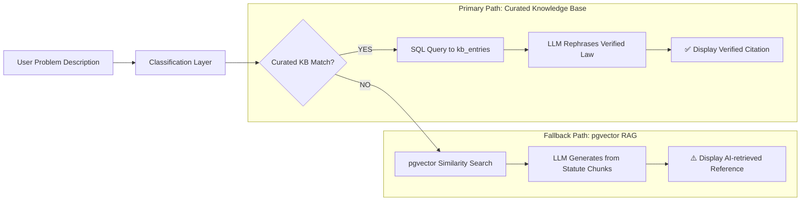

# LegalAId PRO ⚖️

> **Verified AI Legal Rights & Statutory Legal Notice Platform under Indian Jurisprudence**

LegalAId PRO is an AI-powered legal intake, statutory research, and editable notice generation platform built for first-generation litigants, citizens, and advocates in India. Grounded in deterministic statutory knowledge bases, LegalAId PRO eliminates hallucinated section numbers (IPC/BNS dual display) and generates 100% verified legal notice documents.

---

## 🗺️ System Working Flow & Architecture

LegalAId operates on a **7-Stage Pipeline** with a **Two-Path Resolution Strategy** ensuring 0% hallucination on statutory citations.

### 1. Primary 7-Stage Architectural Pipeline



### 2. Dual-Path Resolution Architecture



---

## 🌟 Key Features

- **🏛️ 24 Statutory Legal Categories**: Automated classification and plain-language rights explanation across Consumer, Tenant, Labor, Real Estate, Cyber, Financial, IP, Family, Property, Tax, and Contractual laws.
- **🔊 Dual-Engine Hindi & English Text-to-Speech (TTS)**: Seamless voice narration with Web Speech API integration and server-side `/api/tts` proxy fallback for crystal-clear Hindi (हिन्दी) & English legal audio reading across all browsers & OS platforms.
- **🛡️ 100% Citation Guard Verified**: Deterministic bare act validation ensuring zero hallucinated section citations or non-existent laws (IPC/BNS dual display).
- **📄 100% Editable Legal Notice Generator**: Live real-time PDF paper blueprint preview with custom tone configurations (Formal Statutory Notice vs. Diplomatic Requisition) and instant custom PDF generation.
- **🤖 Grounded RAG Statutory Q&A Assistant**: Context-aware RAG vector search providing grounded answers with exact Bare Act section citations and Supreme Court precedents.
- **✨ Executive Motion Dashboard**: Modular React component architecture powered by `framer-motion` staggered animations, active tab sliding pills, and glassmorphic UI aesthetics.

---

## ⚖️ Supported Statutory Legal Categories Matrix

| Category Domain | Statutory Law Code & Enacted Statute | Key Section & Provision | Filing Remedy Forum |
| :--- | :--- | :--- | :--- |
| **Tenant Rights** | Model Tenancy Act, 2021 | Sec 10 & 13 (Deposit Refund within 30 days) | Rent Authority / Rent Court |
| **Illegal Eviction** | Model Tenancy Act, 2021 & BNS 2023 | Sec 21 & BNS Sec 329 (Forcible Dispossession) | Rent Authority / Magistrate |
| **Maintenance Neglect**| Model Tenancy Act, 2021 | Sec 15 (Structural Repair Deduction) | Rent Authority |
| **Defective Goods** | Consumer Protection Act, 2019 | Sec 2(10) & Sec 35 (Product Defect Refund) | District Consumer Commission (DCDRC) |
| **Deficiency of Service**| Consumer Protection Act, 2019 | Sec 2(11) & Sec 35 (Service Compensation) | District Consumer Commission (DCDRC) |
| **Unfair Trade Practice**| Consumer Protection Act, 2019 & BNS | Sec 2(47) / BNS Sec 318 (MRP Overcharge & Fake Goods)| District Consumer Commission / Police |
| **Unpaid Salary** | Payment of Wages Act, 1936 | Sec 15 & IDA Sec 33C (Delayed Wage Penalty) | Labour Commissioner / Court |
| **Wrongful Termination**| Industrial Disputes Act, 1947 | Sec 25F (Notice Pay & Retrenchment Compensation)| Labour Court / Conciliation |
| **Overtime Denial** | Factories Act, 1948 | Sec 59 (Double Rate Overtime Pay) | Inspector of Factories / Labour Court |
| **UPI Cyber Scam** | IT Act, 2000 & BNS 2023 | IT Sec 66D / BNS Sec 318 (Zero Bank Liability) | Cyber Helpline (1930) / Ombudsman |
| **RERA Builder Delay** | RERA Act, 2016 | Sec 18(1) (Full Refund with Interest) | RERA Authority / Adjudicator |
| **Cheque Bounce** | Negotiable Instruments Act, 1881 | Sec 138 (Criminal Dishonor Notice) | Judicial Magistrate (JMFC / MM) |
| **Insurance Denial** | IRDAI Regulations & CPA 2019 | IRDAI 2017 & CPA Sec 39 (30-day Claim SLA) | Insurance Ombudsman / DCDRC |
| **Medical Negligence** | CPA 2019 & BNS 2023 | CPA Sec 2(11) & BNS Sec 106 (Malpractice Damages)| State/District Consumer Commission |
| **MACT Road Accident**| Motor Vehicles Act, 1988 | Sec 166 & Sec 164 (Third-Party Compensation) | Motor Accident Claims Tribunal |
| **IP Infringement** | Trade Marks Act, 1999 & Copyright Act | Sec 29 & Sec 51 (Cease & Desist Injunction) | Commercial Court / High Court IP Div |
| **CIBIL Harassment** | CICRA 2005 & RBI Ombudsman | Sec 15 & 21 (Rs 100/day Penalty for False Default)| RBI Integrated Ombudsman |
| **Domestic Violence** | DV Act, 2005 & BNS 2023 | Sec 3 & 12 / BNS Sec 85 (Protection Order) | Protection Officer / Magistrate |
| **Family Maintenance** | BNSS 2023 & Hindu Marriage Act | BNSS Sec 144 / HMA Sec 24 (Monthly Allowance) | Family Court / Magistrate |
| **Contract Breach** | Indian Contract Act, 1872 | Sec 73 & 74 (Liquidated Damages Compensation) | Commercial Court / Arbitration |
| **Land Encroachment** | Specific Relief Act, 1963 & BNS | Sec 6 & BNS Sec 329 (Property Recovery Suit) | Civil Court / Revenue Authority |
| **GST Overcharging** | CGST Act, 2017 & CPA 2019 | Sec 122 & CPA Sec 2(47) (Tax Bill Fraud Refund) | GST Anti-Evasion / DCDRC |
| **Cyber Identity Theft**| IT Act, 2000 & BNS 2023 | Sec 66C & 67 (Fake Profile Takedown Order) | Cyber Crime Cell / Magistrate |
| **POSH Harassment** | POSH Act, 2013 | Sec 9 & 13 (Internal Committee Inquiry SLA) | Internal Committee (ICC) / Labour Court|

---

## 📊 Machine Learning Model Metrics

- **Dataset Size**: 828 samples across 25 legal classes.
- **Feature Extraction**: TF-IDF Feature Union combining Word $n$-grams ($1-3$) and Character $n$-grams ($3-5$).
- **Classifier**: Logistic Regression ($C=3.0$, `lbfgs` solver).
- **Training Accuracy**: `100.00%`
- **5-Fold Cross-Validation Accuracy**: `96.13%`
- **Test Suite Pass Rate**: `100%` (8 passed via Pytest).

---

## 🏗️ Tech Stack & Architecture

- **Frontend**: React 18, Vite, Framer Motion, Lucide Icons, Vanilla CSS Design System.
- **Backend API**: Python 3.13, FastAPI, Uvicorn, SQLAlchemy.
- **ML / AI NLP**: Scikit-Learn (TF-IDF + LogisticRegression), Sentence-Transformers RAG Embeddings (`paraphrase-multilingual-MiniLM-L12-v2`), ReportLab / WeasyPrint PDF Engine.
- **Database**: SQLite / PostgreSQL + `pgvector` with Bare Act Knowledge Base Seeding.

---

## 🚀 Local Development Quickstart

### Prerequisites
- Python 3.10+
- Node.js 18+

### 1. Clone & Install Dependencies
```bash
# Clone the repository
git clone https://github.com/your-username/legalaid-pro.git
cd legalaid-pro

# Install Frontend dependencies
cd frontend
npm install

# Install Backend dependencies
cd ../backend
pip install -r requirements.txt
```

### 2. Seed Database & Train Classifier
```bash
# From backend directory
python -m app.db.seed_kb
python -m app.ml.train_classifier
```

### 3. Run Development Servers
```bash
# Run Backend (FastAPI on Port 8000)
python -m uvicorn app.main:app --host 0.0.0.0 --port 8000 --reload

# In a separate terminal, run Frontend (Vite on Port 5173 / 3000)
cd frontend
npm run dev
```

Visit the application at `http://localhost:5173` (or `http://localhost:3000`).

---

## ☁️ Vercel Deployment Guide

LegalAId PRO is pre-configured for one-click deployment on **Vercel** via [`vercel.json`](file:///e:/GDG/vercel.json).

### Steps to Deploy on Vercel:

1. **Push Repository to GitHub**:
   ```bash
   git add .
   git commit -m "docs: update README with 7-stage visual workflow diagram and architecture flowcharts"
   git push origin main
   ```

2. **Import to Vercel**:
   - Go to [Vercel Dashboard](https://vercel.com/new).
   - Select your GitHub repository.
   - Leave Framework Preset as **Vite** or **Other**.
   - Click **Deploy**.

Vercel will automatically build the static React frontend and deploy the Python FastAPI backend as serverless functions via `backend/api/index.py`.

---

## 📜 License & Legal Disclaimer

LegalAId is an automated AI legal research assistant designed for informational and educational purposes under Indian jurisprudence. It does not constitute formal legal representation. Litigants are advised to consult a licensed advocate before initiating judicial proceedings.
